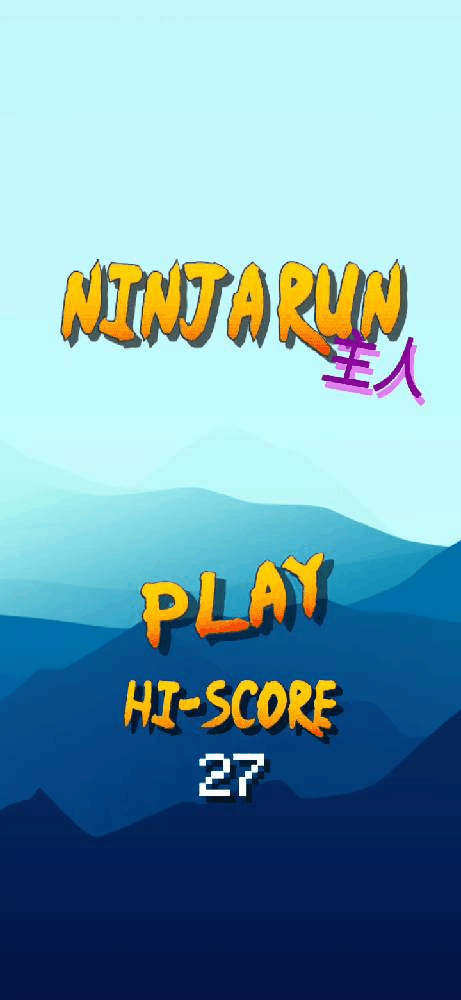
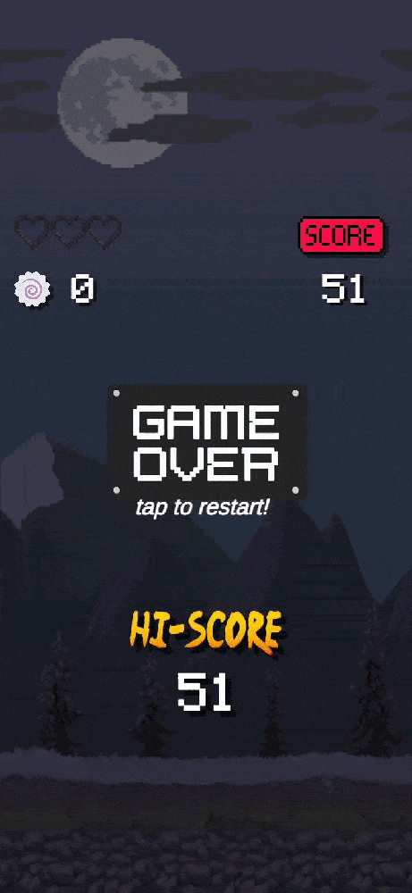

# Game Development - Unity 2D Games

Some adventures of a begginer game dev in Unity C#;

## 1 - Ninja Run (Android)

A 2D Endless Run game was my first choice to learn about game development in Unity. I had a lot of fun implementing and testing this game, and had a great feedback from users.
The main objective is to survive the maximum waves possible, using escape and survivor strategies. Developed for Android devices.

OBS: Characters's sprites are from fans of the anime Naruto. Due to copyright settings, only scripts will be available in the repository.

Features:
- Parallax Effect on scenario;
- Moving obstacles and enemies;
- High Score, Main Menu and Game Over Screen.

Characters sprites source: 

#### Development Game Screenshots

<table>
  <tr>
    <td>Main Menu</td>
     <td>Gameplay Scene</td>
     <td>Game Over Screen</td>
  </tr>
  <tr>
    <td></td>
    <td></td>
    <td></td>
  </tr>
 </table>

## 2 - Platformer Level-Based Game (PC/Mac/Linux)

In maintenance..
