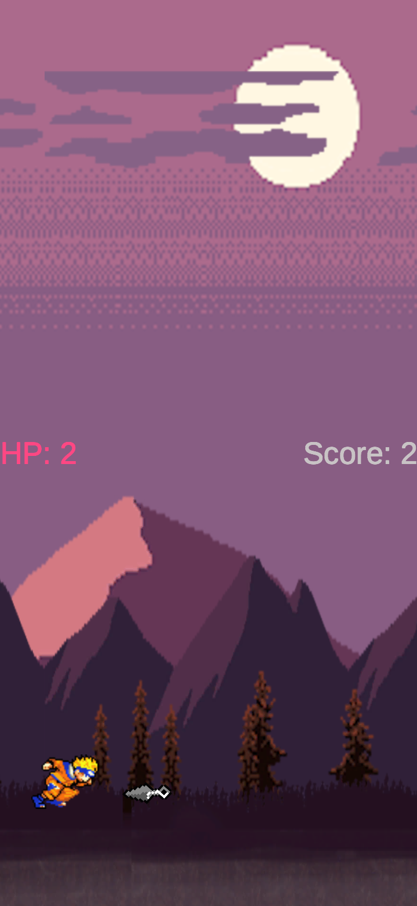
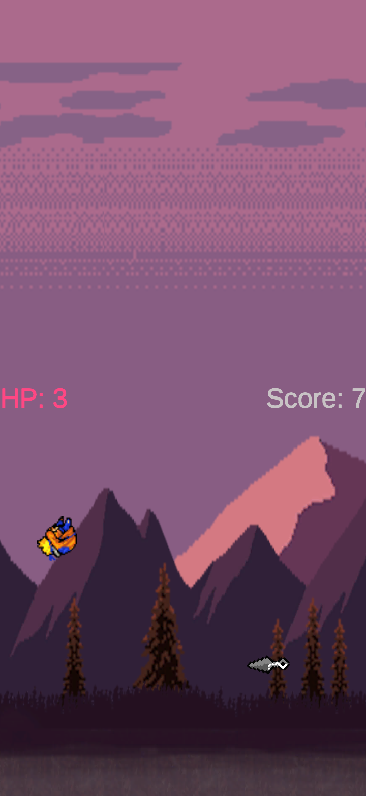
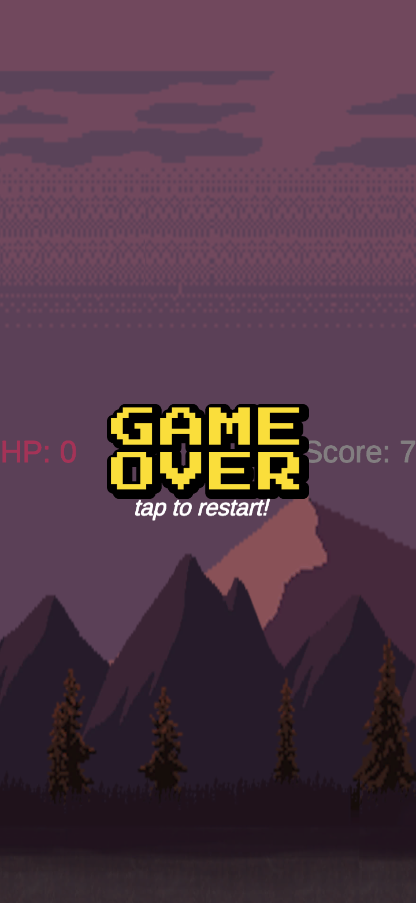

# Game Development - Unity 2D Platform Games

Repositório criado para jogos de estilo Plataforma programados em C#, em ambiente Unity.

## 1 - Platformer Endless Running Game (Android)

Para tomar início ao desenvolvimento de jogos em Unity (C#), foi desenvolvido um jogo plataforma de estilo corrida infinita, disposto em modo Retrato para dispositivos Android. Este jogo conta com:
- cenário de múltiplas camadas em efeito Parallax;
- obstáculos em três posições diferentes; 
- placares indicadores de vida e Score;

