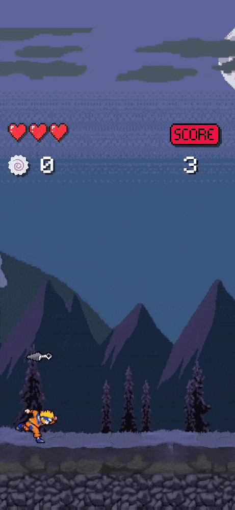

# Ninja Run - Android 2D Game :video_game::running:

Ninja Run is a 2D endless runner game and it was my first theme choice to learn about game development in Unity.    

The **main objective** is to survive the maximum shuriken/attacks waves possible, using **jump button**(clicking at the mid-upper screen space) to scape and survive them.  
I had a lot of fun developing and testing this game, and hope you will have fun playing it. For the record, the **known highscore** is 990 points.  

PS: Characters's sprites are from Naruto fans (http://www.narutohq.com/sprites.php).

## Features and download link :arrow_down:

You can [download it directly here.](http://abre.ai/ninja-run)  
Note: This game was developed exclusively to education purposes.

Features:
- Parallax Effect in background;
- Moving obstacles and enemies;
- High Score, Main Menu and Game Over Screen.

## Game Scenes :movie_camera:
<table>
  <tr>
    <td>Main Menu</td>
     <td>Gameplay Scene</td>
     <td>Game Over Screen</td>
  </tr>
  <tr>
    <td></td>
    <td></td>
    <td></td>
  </tr>
 </table>
